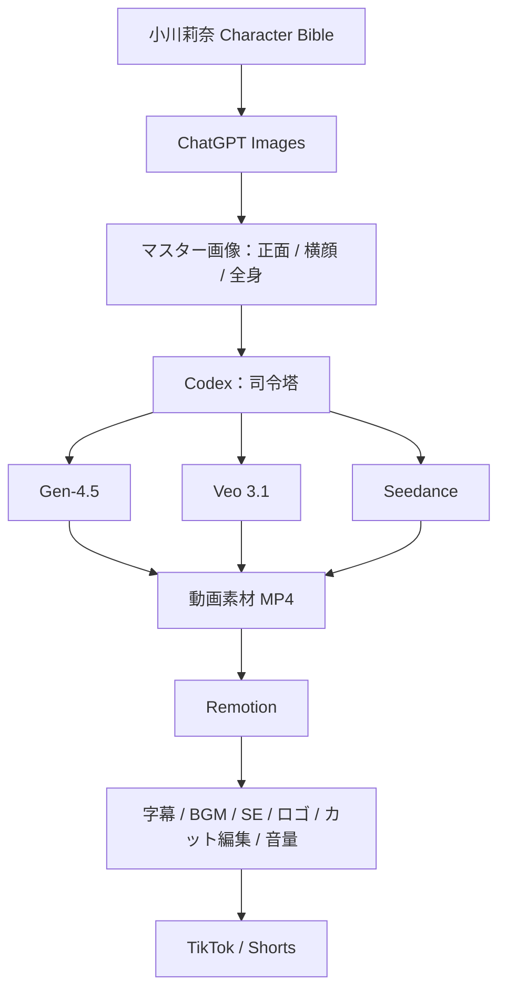

# AIタレント 小川莉奈 — 公式制作プロジェクト

このリポジトリは、AIタレント「小川莉奈」のCharacter Bible、素材、SNSコンテンツ、Remotion動画制作を一元管理する公式制作リポジトリです。

## キャラクター設定と制作基盤

- [Character Bible](character/character-bible.md)：キャラクター設定の正史（canonical）。
- [Visual Guide](character/visual-guide.md)：確定済みの外見ルール。ユーザー提供の [基準画像](public/assets/reference/rina-base.jpg) を最優先のVisual Referenceとし、左下のボブを主基準、右下のお団子をアレンジ参考とします。
- [Voice Guide](character/voice-guide.md)：口調・価値観・発言ルール。声質は未確定です。
- [Relationships](character/relationships.md)：美咲・奈緒との関係性。
- [制作フロー](docs/production-workflow.md)：ChatGPT Images、Codex、動画生成モデル、Remotionの役割と素材管理。
- [TikTok #001：サーブ練習](contents/001-tennis-serve/README.md)：採用済み企画。構成・生成指示を準備済み、動画素材は未生成です。
- [一人焼肉の企画候補](contents/001-hitori-yakiniku/README.md)：保留中。投稿順は未定です。

素材の格納先は `public/assets/` 配下の `rina/`、`reference/`、`golf/`、`tennis/`、`drums/`、`misaki/`、`nao/` です。`reference/rina-base.jpg` に提供された基準画像を加工せず保存しています。各ディレクトリにはGitで格納先を保持するための `.gitkeep` も配置しています。

現段階ではキャラクター設定と基準画像を登録し、テニス姿の参考画像を生成済みです。正面・横顔・全身のマスター画像は未整備で、動画素材の生成と完成動画の書き出しは未着手です。制作ではCharacter Bibleを基準とし、未確定事項は確定設定と区別して扱います。

## 制作フロー



Codexが企画・参照画像・生成指示・素材確認・編集を統括し、各動画生成モデルで作ったMP4をRemotionで仕上げます。モデルはカットごとに選択し、毎回すべてを使う必要はありません。この図は採用する制作方針を示すもので、各サービスへの接続完了を示すものではありません。

既存のRemotion構成と `.agents/skills/` を維持しています。以下はRemotionの既存案内です。

## Remotion video

<p align="center">
  <a href="https://github.com/remotion-dev/logo">
    <picture>
      <source media="(prefers-color-scheme: dark)" srcset="https://github.com/remotion-dev/logo/raw/main/animated-logo-banner-dark.apng">
      
    </picture>
  </a>
</p>

Welcome to your Remotion project!

## Commands

**Install Dependencies**

```console
npm i
```

**Start Preview**

```console
npm run dev
```

**Render video**

```console
npx remotion render
```

**Upgrade Remotion**

```console
npx remotion upgrade
```

## Docs

Get started with Remotion by reading the [fundamentals page](https://www.remotion.dev/docs/the-fundamentals).

## Help

We provide help on our [Discord server](https://discord.gg/6VzzNDwUwV).

## Issues

Found an issue with Remotion? [File an issue here](https://github.com/remotion-dev/remotion/issues/new).

## License

Note that for some entities a company license is needed. [Read the terms here](https://github.com/remotion-dev/remotion/blob/main/LICENSE.md).
