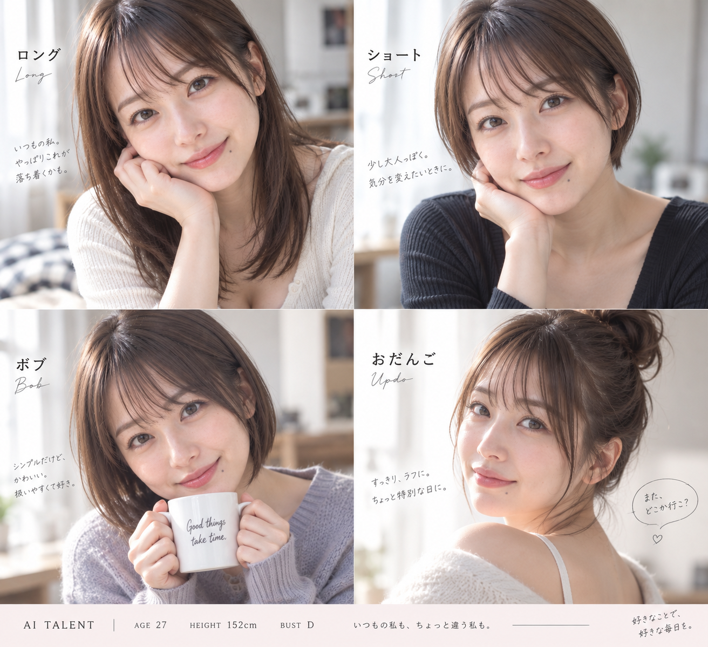
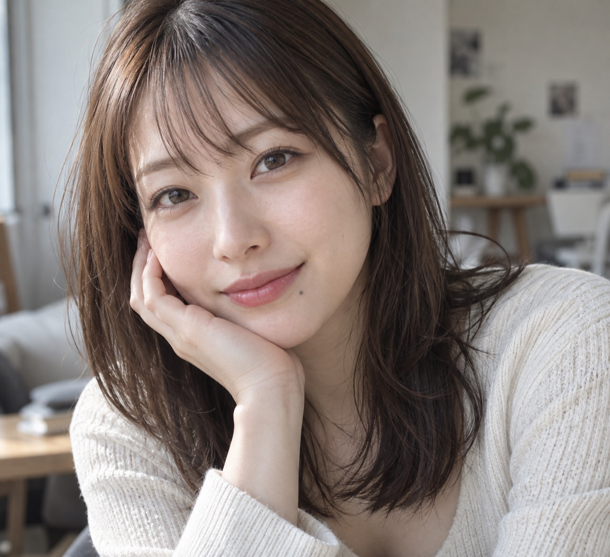
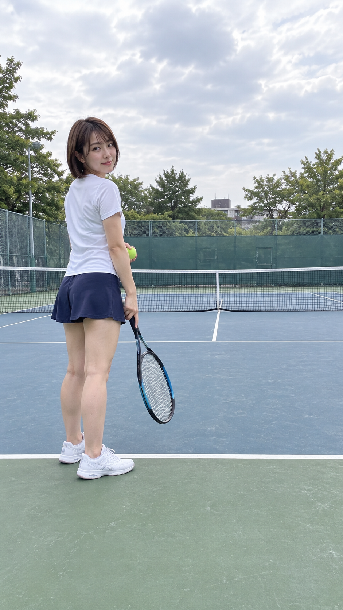

# 小川莉奈

[プロフィール](profile.md) · [外見・基準画像のルール](visual-guide.md) · [口調](voice-guide.md) · [関係性](../relationships.md) · [自宅](home/README.md)

## ベースビジュアル

従来の人物再現では原本の左下のボブを主基準、右下のお団子をアレンジ参考にします。

自宅設定とともに登録された人物ベースv1も保存しています。従来の原本を置き換えるかは未確定です。

## サブビジュアル

### テニス

人物・衣装の検討用。コートの不整合があるためサーブの開始フレームとしては未採用です。

## 写真を追加

[画像の投入口](images/inbox/README.md)に追加してください。採用した写真は[サブ画像](images/variations/)へ整理します。

