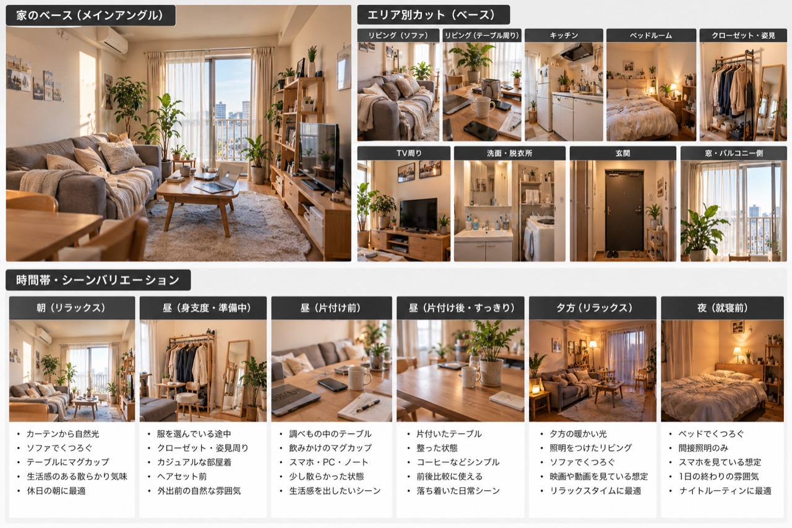

# 小川莉奈 設定資料 — 自宅ベース v1.0

## 目的
小川莉奈の静止画・動画生成で、毎回同じ家に見えるよう背景設定を固定する。
「家そのもの」は変えず、時間帯・生活状態・身支度の進行を組み替えて使用する。

## 参照素材
- 自宅ベース画像: `references/home/rina-home-base-v1.jpg`
- 小川莉奈ベース画像: `references/character/rina-character-base-v1.jpg`

> 画像は別ブランチから追加予定。ファイル名は上記で固定する。

### 自宅ベース画像

## 自宅のベース
- 大阪市内で一人暮らしをしている想定の、現実的な1K〜1LDK。
- 白〜ベージュ、明るい木目を中心にした暖色寄りの内装。
- 大きな窓とバルコニーがあり、昼間は自然光が入る。
- グレー〜グレージュ系ソファ、木製ローテーブル、テレビ台、オープン棚、観葉植物を基本要素とする。
- 高級マンションやモデルルームにはしない。20代会社員が実際に暮らしている程度の家具・生活用品を置く。
- 完璧に片付いた部屋ではなく、マグカップ、スマホ、充電ケーブル、ブランケット、本・ノートなどで軽い生活感を出す。
- エリアはリビング（ソファ／テーブル／TV）、キッチン、ベッドルーム、クローゼット・姿見、洗面・脱衣所、玄関、窓・バルコニー側を基本とする。

## 背景バリエーション

### 朝 — リラックス
カーテン越しの柔らかい自然光。ソファ周辺にはブランケットやマグカップなどが残り、休日の朝らしい軽い散らかりがある。まだ外出準備前。

### 昼 — 身支度・準備中
自然光が十分に入った明るい室内。クローゼット・姿見周辺を使い、服を選んでいる途中の状態。バッグや候補の服など、準備途中の物が少量見える。

### 昼 — 片付け前
テーブルにスマホ、PC、ノート、飲みかけのマグなどがあり、小物が少し散らばっている。汚部屋ではなく「生活していた結果の散らかり」に留める。

### 昼 — 片付け後
同じ家具配置のまま、テーブル上やソファ周辺だけが整っている。物を消しすぎず、マグカップや観葉植物など最低限の生活感は残す。

### 夕方 — リラックス
窓の外が夕方の色になり、室内照明をつけ始める。ソファでスマホや動画を見るのに合う、少し落ち着いた空気。

### 夜 — 就寝前
主照明ではなく間接照明中心。ベッド周辺を主な背景にする。スマホを見たり、ベッドでくつろいだりする一日の終わりの雰囲気。

## 一貫性ルール
1. 家具の種類・色・配置、窓、床、壁、主要な観葉植物など「家の骨格」は固定する。
2. シーン差は、光、散らかり具合、生活小物、カーテン、照明のON/OFFで表現する。
3. 時間帯を変えても別の部屋・別の物件に見える変更をしない。
4. 「片付け前」と「片付け後」は同じ部屋・同じ日のBefore/Afterとして成立させる。
5. 身支度シーンではクローゼット・姿見・洗面周辺を優先し、リビングの設定と矛盾させない。
6. 背景は莉奈より主張させず、SNS/Vlogで自然に映り込む生活空間として扱う。

## 生成時の使い方
画像・動画生成では「自宅ベース」＋「使用エリア」＋「時間帯・シーンバリエーション」を選択する。
例: 「自宅ベース / リビング・ソファ / 朝・リラックス」「自宅ベース / クローゼット・姿見 / 昼・身支度中」。

人物の顔・体型・髪型などの一貫性は `references/character/rina-character-base-v1.jpg` を基準にし、
背景の一貫性は `references/home/rina-home-base-v1.jpg` を基準にする。
